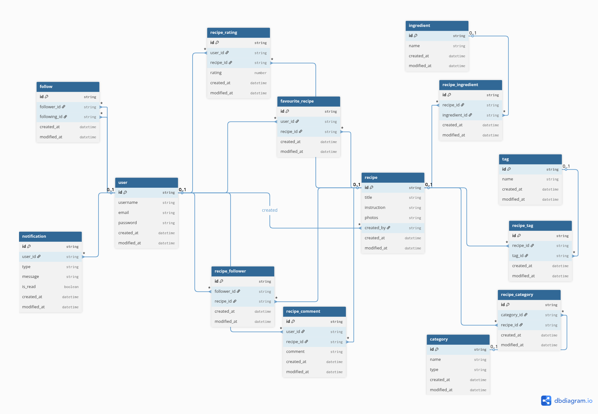

# Database Schema Documentation

## Entity Relationship Diagram



The Recipe Sharing API uses a comprehensive relational database design with **14 entities** and complex relationships.

## Core Entities

### 1. User Management

- **`user`** - User accounts with authentication
- **`follow`** - User-to-user following relationships
- **`notification`** - User activity notifications

### 2. Recipe System

- **`recipe`** - Recipe content with photos and instructions
- **`favourite_recipe`** - User's saved recipes
- **`recipe_follower`** - Users following specific recipes

### 3. Recipe Interactions

- **`recipe_rating`** - Recipe ratings (1-5 stars)
- **`recipe_comment`** - User comments on recipes

### 4. Recipe Organization

- **`ingredient`** - Recipe ingredients
- **`recipe_ingredient`** - Many-to-many relationship between recipes and ingredients
- **`tag`** - Recipe tags for categorization
- **`recipe_tag`** - Many-to-many relationship between recipes and tags
- **`category`** - Recipe categories (cuisine, meal type, dietary)
- **`recipe_category`** - Many-to-many relationship between recipes and categories

## Detailed Entity Specifications

### User Entity

```sql
user {
  id: string (PK, UUID)
  username: string (UNIQUE)
  email: string (UNIQUE)
  password: string (HASHED)
  createdAt: datetime
  updatedAt: datetime
}
```

### Recipe Entity

```sql
recipe {
  id: string (PK, UUID)
  title: string (UNIQUE)
  instruction: text
  photos: string[] (ARRAY)
  created_by: string (FK -> user.id)
  createdAt: datetime
  updatedAt: datetime
}
```

### Ingredient Entity

```sql
ingredient {
  id: string (PK, UUID)
  name: string (UNIQUE)
  createdAt: datetime
  updatedAt: datetime
}
```

### Tag Entity

```sql
tag {
  id: string (PK, UUID)
  name: string (UNIQUE)
  createdAt: datetime
  updatedAt: datetime
}
```

### Category Entity

```sql
category {
  id: string (PK, UUID)
  name: string (UNIQUE)
  type: string
  createdAt: datetime
  updatedAt: datetime
}
```

### Social Interaction Entities

#### Follow Relationship

```sql
follow {
  id: string (PK, UUID)
  follower_id: string (FK -> user.id)
  following_id: string (FK -> user.id)
  createdAt: datetime
  updatedAt: datetime
}
```

#### Recipe Rating

```sql
recipe_rating {
  id: string (PK, UUID)
  user_id: string (FK -> user.id)
  recipe_id: string (FK -> recipe.id)
  rating: number (1-5)
  createdAt: datetime
  updatedAt: datetime
}
```

#### Recipe Comment

```sql
recipe_comment {
  id: string (PK, UUID)
  user_id: string (FK -> user.id)
  recipe_id: string (FK -> recipe.id)
  comment: string
  createdAt: datetime
  updatedAt: datetime
}
```

#### Favorite Recipe

```sql
favourite_recipe {
  id: string (PK, UUID)
  user_id: string (FK -> user.id)
  recipe_id: string (FK -> recipe.id)
  createdAt: datetime
  updatedAt: datetime
}
```

#### Notification

```sql
notification {
  id: string (PK, UUID)
  user_id: string (FK -> user.id)
  type: string
  message: string
  is_read: boolean
  createdAt: datetime
  updatedAt: datetime
}
```

## Key Relationships

### User Relationships

- One user can create many recipes
- One user can follow many other users
- One user can be followed by many users
- One user can have many notifications
- One user can favorite many recipes
- One user can rate many recipes
- One user can comment on many recipes

### Recipe Relationships

- One recipe can have many ingredients
- One recipe can have many tags
- One recipe can belong to many categories
- One recipe can be rated by many users
- One recipe can have many comments
- One recipe can be favorited by many users
- One recipe can be followed by many users

## Database Features

- **UUID Primary Keys** for better distributed system support
- **Timestamps** on all entities for audit trails
- **Unique Constraints** on usernames, emails, and tag names
- **Foreign Key Constraints** for data integrity
- **Cascade Deletes** for proper cleanup
- **Many-to-Many Relationships** with junction tables

## Migration Strategy

The database uses Sequelize migrations for:

- Schema versioning
- Environment-specific configurations
- Rollback capabilities
- Team collaboration

## Seeding Strategy

Comprehensive seed data includes:

- Sample users with hashed passwords
- Common ingredients and categories
- Sample recipes with realistic data
- Relationship data for testing

## Security Considerations

- Password hashing with bcrypt
- Input validation and sanitization
- SQL injection prevention through ORM
- Proper foreign key constraints
- Audit trails with timestamps
